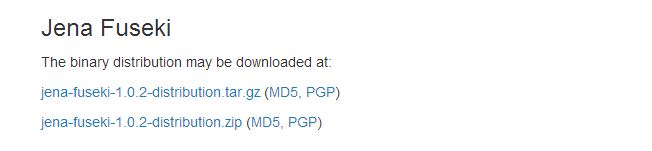
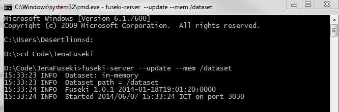

# semweb-familytree
=================

Semantic Web Assignment Application using PHP

## Team Member:   
@author Rijalul Fikri, Diah Sekar Sari R, Fendy Tricahyono, Cahyo W.

## Requirements
### Composer
This application uses [composer](https://getcomposer.org/download/) to manage dependencies. You have to install it first.   
> You'll need to specify the PHP directory, For Example if you're using Windows and XAMPP, usually it's located in C:\xampp\php

### NodeJs
We're using [Gulp](http://gulpjs.com/) as the `task runner`. In order to install `gulp`, we have to install [NodeJs](http://nodejs.org/) first.

If you have NodeJs already installed then use this [getting started](https://github.com/gulpjs/gulp/blob/master/docs/getting-started.md#getting-started) to install `gulp`.

`Gulp` is used to compile sass into css, and also to minify javascript. You can check the tasks by opening `gulpfile.js`. You can use gulp by typing `gulp` from the command line at the root of this application.

### Bower
[Bower](http://bower.io/) is used to manage the assets needed for this project. Same as `Gulp` we'll also need `NodeJs` to install `Bower`. Just type `npm install -g bower` to install bower globally.

### Jena Fuseki
We're using Jena Fuseki as the triple store. You can download it [here](http://jena.apache.org/download/index.cgi)   

## Getting Started
### Cloning this Repo and pulling the dependencies
- Type `git clone https://github.com/dl-ugm/semweb-familytree.git`
- cd to `semweb-familytree` and type `composer update` to pull the php dependencies
- then run `bower install` to pull all the assets used in this project

### Starting Fuseki Server
- Go to your Fuseki installation directory
- Start a fuseki server with in-memory storage: $ ./fuseki-server --update --mem /dataset (the --update flag tells the server to accept SPARQL updates; the --mem flag tells the server to use in memory storage; the /dataset part is a name for the dataset.

- Open a new browser window and visit the homepage of your Fuseki server at http://localhost:3030/
- Click on Control Panel; you can upload your owl file using the control panel

### Start this Application
- Open a new terminal window and cd to this project directory
- Type `php -S localhost:8000`
- Open a new browser window and access http://localhost:8000
